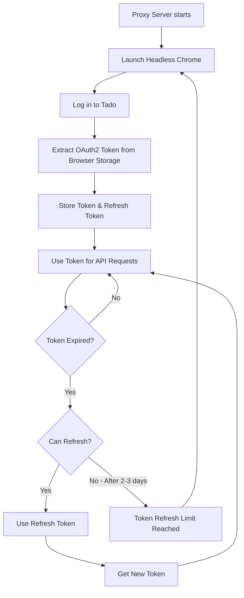

# tado API Proxy
A proxy server to bypass tado's new rate limits on their public API. It uses their browser OAuth2 client to authenticate requests, which has much higher rate limits.

## Usage
> [!IMPORTANT]
> Make sure to create the `/path/to/data` directory on your host machine with proper permissions so that the container can read and write files in it. The folder should be writable by user `1000:1000`.
>
> If you get `open /config/cookies.json: permission denied`, try running: `sudo chown -R 1000:1000 /path/to/data`, replacing `/path/to/data` with your actual path.

Run the container with your credentials:
```sh
docker run -d \
  -p 8080:8080 \
  -v /path/to/data:/config \
  --restart unless-stopped \
  -e EMAIL=you@email.com \
  -e PASSWORD=yourpassword \
  ghcr.io/s1adem4n/tado-api-proxy:latest
```

Then access the API like you would normally do, except replacing `https://my.tado.com` with `http://localhost:8080`.

For example, to get your profile:
```sh
curl http://localhost:8080/api/v2/me
```

You can also access the API documentation at `http://localhost:8080/docs`.

## Configuration
| Environment Variable | Description                        | Default                                |
| -------------------- | ---------------------------------- | -------------------------------------- |
| LISTEN_ADDR          | Address to listen on               | `:8080`                                |
| TOKEN_PATH           | Path to token file                 | `token.json`                           |
| COOKIES_PATH         | Path to cookies file               | `cookies.json`                         |
| EMAIL                | tado email address                 | *required*                             |
| PASSWORD             | tado password                      | *required*                             |
| CHROME_EXECUTABLE    | Path to Chrome/Chromium executable | `/usr/bin/chromium`                    |
| HEADLESS             | Run browser in headless mode       | `true`                                 |
| CLIENT_ID            | OAuth2 client ID                   | `af44f89e-ae86-4ebe-905f-6bf759cf6473` |


## How it works


## Acknowledgements
- [kritsel/tado-openapispec-v2](https://github.com/kritsel/tado-openapispec-v2) - Community managed OpenAPI specification for the tado API
- [go-rod/rod](https://github.com/go-rod/rod) - Go library for browser automation
- [scalar/scalar](https://github.com/scalar/scalar) - API documentation viewer
