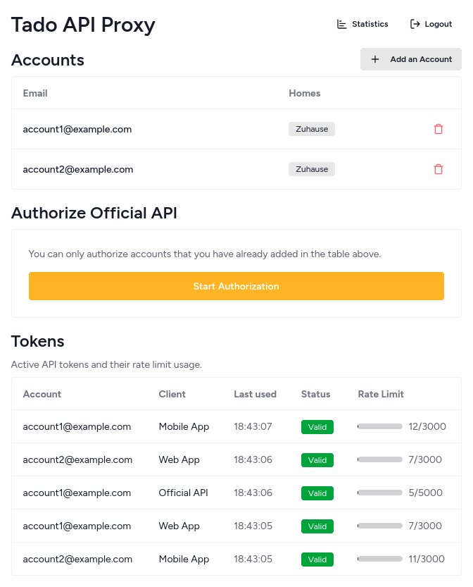

# tado API Proxy

A self-hosted proxy for the tado API that stores and rotates OAuth tokens on your server. It includes a built-in web UI for managing accounts and tokens.

> [!WARNING]
> Use at your own risk. tado has recently begun locking out users who generate high request volumes via third-party tools. While this proxy implements rate limiting to mitigate detection, it is still possible for tado to ban an account.

## Screenshots

<table align="center">
  <tr>
    <th>Home Page</th>
    <th>Statistics Page</th>
  </tr>
  <tr>
    <td></td>
    <td></td>
  </tr>
</table>

## Features

- Web admin UI for managing accounts, tokens, and device-code authorizations
- Multiple tado accounts with different homes supported
- Balances usage between tokens
- Automatic token refresh and request logging
- Optional authentication to the official tado API client

## Installation

### Docker

Create a data directory with proper permissions:

```sh
mkdir -p /path/to/data
sudo chown -R 1000:1000 /path/to/data
```

Run the container and create the initial superuser:

```sh
docker run -d \
  -p 8080:8080 \
  -v /path/to/data:/config \
  --restart unless-stopped \
  -e SUPERUSER_EMAIL=admin@example.com \
  -e SUPERUSER_PASSWORD=change-me \
  ghcr.io/s1adem4n/tado-api-proxy:latest
```

### Binary

Download the latest release from the [releases page](https://github.com/s1adem4n/tado-api-proxy/releases).

```sh
export SUPERUSER_EMAIL=admin@example.com
export SUPERUSER_PASSWORD=change-me
./tado-api-proxy serve --dir ./pb_data --http :8080
```

### From Source

Requires Go 1.25.5+ and Bun.

```sh
git clone https://github.com/s1adem4n/tado-api-proxy.git

cd tado-api-proxy/web
bun install --frozen-lockfile
bun run build

cd ..
export SUPERUSER_EMAIL=admin@example.com
export SUPERUSER_PASSWORD=change-me
go run cmd/main.go serve --dir ./pb_data --http :8080
```

## Quick Start

1. Open the admin UI at http://localhost:8080 and log in with your superuser account.
2. Add a tado account (email + password). Tokens for the web and mobile apps are created automatically.
3. Send API requests by replacing `https://my.tado.com` with your proxy URL.

```sh
curl http://localhost:8080/api/v2/me
```

> [!TIP]
> **Which account should I use?** It is recommneded to use a burner account instead of your main tado account to protect it from potential bans. Simply create a new account, invite it to your home, and add it to the proxy. For details about creating burner accounts and more optimizations, see [Rate Limit Optimization](#advanced-rate-limit-optimization).

## Usage

### API Access

Replace `https://my.tado.com` with your proxy URL (e.g., `http://localhost:8080`).

**Basic Request (auto-balanced)**: The proxy will select an available account automatically.

```sh
curl http://localhost:8080/api/v2/me
```

**Specific Account Request**: Force the request to use a specific tado account using the header.

```sh
curl -H "X-Tado-Email: burner1@email.com" http://localhost:8080/api/v2/me
```

**API Documentation**: OpenAPI documentation is available at http://localhost:8080/docs.

### Integration with Home Assistant

TODO!

### Integration with Homebridge

The Homebridge plugin supports changing the API base URL. Just point it to your proxy instance and it should *just work*™.

For more details about setting it up, see these comments:

- [Changing the base URL](https://github.com/homebridge-plugins/homebridge-tado/issues/176#issuecomment-3419839118)
- [Details about running with Docker/Systemd (outdated)](https://github.com/homebridge-plugins/homebridge-tado/issues/176#issuecomment-3421497695)

## Advanced: Rate Limit Optimization

To maximize your rate limit and reduce the risk of bans, add multiple burner tado accounts to your home. The proxy balances requests across accounts and clients, making automated usage harder to detect. If tado issues a ban, they currently ban the specific account—not the home—protecting your primary account.

<details>
<summary><strong>How to create and add burner accounts</strong></summary>

1. Open a private browsing window.
2. Go to [temp-mail.org](https://temp-mail.org) or use another new email address.
3. Go to [login.tado.com](https://login.tado.com) and create an account with that email. Don't create a new home for this account!
4. In another browser window (where you're logged into your main account), invite this email to your home.
5. Accept the invite in the private browsing window.
6. Add the account to the proxy in the web UI.

Repeat these steps to add more accounts and increase your rate limit further.

</details>

### Authorize Official API (Optional)

You can also authorize accounts for the official tado API client, which increases your rate limit even further.

1. In the web UI, click `Start Authorization` in the "Authorize Official API" section.
2. Complete the authorization flow—make sure you're logged into the correct tado account when accepting!

This adds the official API client to the rotation alongside the web and mobile app tokens.

## Configuration

The server is a PocketBase app. Runtime flags are the same as PocketBase (`serve --dir`, `--http`, etc.).

Environment variables:
| Variable | Description | Required |
| ------------------ | ---------------------------------------------- | -------- |
| SUPERUSER_EMAIL | Initial superuser email (created on first run) | Yes\* |
| SUPERUSER_PASSWORD | Initial superuser password | Yes\* |

\*Only required if no superuser exists yet.

## Credits

- [kritsel/tado-openapispec-v2](https://github.com/kritsel/tado-openapispec-v2) - Community OpenAPI specification
- [pocketbase/pocketbase](https://github.com/pocketbase/pocketbase) - Embedded database and admin API
- [scalar/scalar](https://github.com/scalar/scalar) - API documentation viewer
- [wmalgadey/PyTado](https://github.com/wmalgadey/PyTado) - Disclaimer inspiration :P

## Disclaimer

This software is provided for educational purposes only and is provided "as is" without warranty of any kind, explicit or implied, under the MIT license.
I am not affiliated with, associated with, or endorsed by tado° GmbH. This project was created for personal use to experiment with IoT systems. I have no business interest in tado. Please use this software responsibly and do not use it for malicious purposes.
